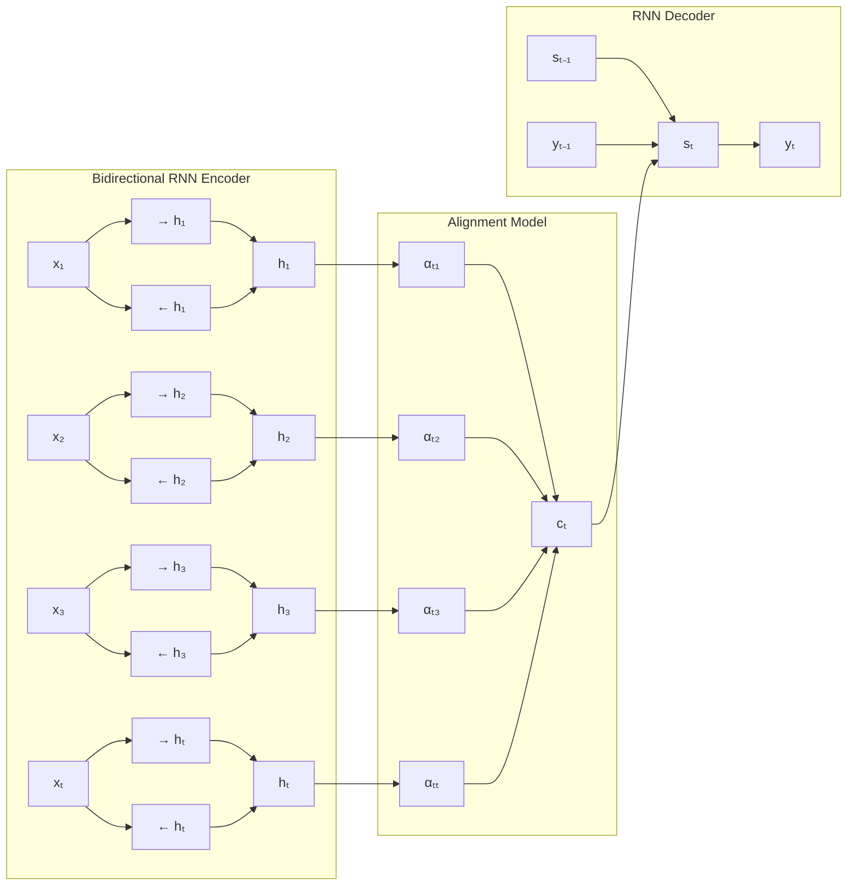

# [NEURAL MACHINE TRANSLATION BY JOINTLY LEARNING TO ALIGN AND TRANSLATE](https://arxiv.org/pdf/1409.0473)

Approach for Machine Translation
instead of using a statistical machine, you build a single neuron that is tuned for maximum performance.

# INTRODUCTION
The neural machine translation attempts to build and train a single, large neural network that reads a sentence and outputs 
a correct translation.
It belongs to a family of *encoder-decoder*.
An encoder neural network reads and encodes a source sentence into a fixed-length vector. 
A decoder then outputs a translation from the encoded vector.

The pair is trained jointly to maximise probability of a correct translation given a source sentence.

*Problem*: NN needs to compress all info to a fixed size vector, hence dealing with long sentences is hard. the performance of
a basic encoder–decoder deteriorates rapidly as the length of an input sentence increases.
*Solution*:  introduce an extension to the encoder–decoder model which learns to align and translate jointly.

*Distinguishing Feature*: it does not attempt to encode a whole input sentence into a single fixed-length vector. 
It tries to encodes the input sentence into a sequence of vectors and chooses a subset of these vectors adaptively while decoding the translation.

# NEURAL MACHINE TRANSLATION
well you can say like translation is equivalent to finding a target sentence y that maximises the conditional probability of y given a source sentence x
find best english sentence y, given french sentence x
i.e. arg maxy p(y | x)

hence model can now predict the translation given a original sentence by searching for the sentence that maximizes the conditional probability.

2 components:
- 1st to encode a source sentence `x`
- 2nd to decode toa target sentence `y`

RNN with LSTM >  conventional phrase-based machine translation system

## RNN Encoder-Decoder 

In the encoder–decoder framework:

The encoder reads the input sequence step-by-step and updates a hidden state:

$$
h_t = f(x_t, h_{t-1})
$$

The hidden states are then combined into a **context vector**:

$$
c = q({h_1, h_2, ..., h_{T_x}})
$$

This context vector summarizes the source sentence and is passed to the decoder.

The decoder predicts each output word sequentially by modeling:

$$
p(y) = \prod_{t=1}^{T} p(y_t \mid y_1,...,y_{t-1}, c)
$$

Each probability is computed using the decoder hidden state:

$$
p(y_t \mid y_1,...,y_{t-1}, c) = g(y_{t-1}, s_t, c)
$$

where:

* $h_t$ = encoder hidden state
* $s_t$ = decoder hidden state
* $c$ = context vector
* $f$, $g$ = nonlinear functions (often implemented using LSTM)

---

#  LEARNING TO ALIGN AND TRANSLATE
New architecture for neural machine translation:
- encoder: bidirectional RNN 
- decoder: emulates searching through a source sentence during decoding a translation 

Key idea:
> Instead of encoding the entire sentence into a single fixed-length vector, the model encodes the sentence into a sequence of vectors and lets the decoder decide which parts are most relevant at each step.

The architecture consists of:
- **Encoder** → Bidirectional RNN (BiRNN)
- **Decoder** → RNN with attention mechanism
- **Alignment model** → learns which words in the source sentence are most relevant when predicting each target word

Given source sentence:

$
x = (x_1, x_2, ..., x_{T_x})
$

the model generates translation:

$
y = (y_1, y_2, ..., y_{T_y})
$

Instead of using a single context vector, the decoder computes a **different context vector for each output word**.

The decoder predicts each word sequentially:

$
p(y_i \mid y_1, ..., y_{i-1}, x)
$

computed as:

$
p(y_i \mid y_1, ..., y_{i-1}, x) = g(y_{i-1}, s_i, c_i)
$

where:

* ( $s_i$ ) = hidden state of decoder at step i
* ( $c_i$ ) = context vector for step i
* ( $g$ ) = nonlinear function (e.g., softmax layer)

Decoder hidden state update:

$$
s_i = f(s_{i-1}, y_{i-1}, c_i)
$$

Key improvement:

Each output word ($y_i$) gets its **own context vector($c_i$)**, instead of sharing one global vector.

**Encoder generates annotations**:

$h_j = [\overrightarrow{h_j}; \overleftarrow{h_j}]$

**Context vector**:

Instead of using only the last hidden state, the decoder computes a context vector specific to each output word.

The context vector is computed as a weighted sum of encoder annotations:

$c_i = \sum_{j=1}^{T_x} \alpha_{ij} h_j$

where:

* ($h_j$) = annotation for word ($x_j$)
* ($\alpha_{ij}$) = attention weight
* ($\alpha_{ij}$) measures how relevant word ($x_j$) is when predicting word ($y_i$)

Properties of attention weights:

$
\sum_{j=1}^{T_x} \alpha_{ij} = 1
$

Thus:

* large ( $\alpha_{ij}$ ) → model focuses strongly on word ($x_j$)
* small ( $\alpha_{ij}$ ) → word contributes less to prediction

**Decoder update**: $s_i = f(s_{i-1}, y_{i-1}, c_i)$

**Output probability**: $p(y_i|y_1,...,y_{i-1},x) = g(y_{i-1}, s_i, c_i)$

---

# ENCODER: BIDIRECTIONAL RNN (BiRNN)

In a standard RNN encoder, the input sentence is read from left to right:

$
x_1 \rightarrow x_2 \rightarrow ... \rightarrow x_{T_x}
$

However, understanding a word often requires context from both:

* words before it
* words after it

To capture both directions, we use a **Bidirectional RNN (BiRNN)**.

A BiRNN consists of:

### Forward RNN

Processes sequence from left to right:

$
\overrightarrow{h_j} = f(x_j, \overrightarrow{h_{j-1}})
$

### Backward RNN

Processes sequence from right to left:
$
\overleftarrow{h_j} = f(x_j, \overleftarrow{h_{j+1}})
$
Each word is annotated with both representations:

$$
h_j =
\begin{bmatrix}
\overrightarrow{h_j} \
\overleftarrow{h_j}
\end{bmatrix}
$$

Thus, each annotation vector (h_j) contains information about:

* preceding words
* following words
* surrounding context

Because RNNs tend to emphasize nearby words, each annotation focuses strongly on words close to position (j).

The sequence of annotations: $(h_1, h_2, ..., h_{T_x})$ is passed to the decoder.

---

# Experiment Settings

- [DataSet](https://www.statmt.org/wmt14/translation-task.html)
WMT has: Europarl (61M words), news commentary (5.5M), UN (421M) and two crawled corpora of 90M and 272.5M words respectively,
totaling 850M words

reduce to 348M words using the [data selection method by Axelrod](http://www-lium.univ-lemans.fr/~schwenk/cslm_joint_paper/)
merge both 2012, 2013 news-paper readings, evaluate model on set (news-test-2014) from WMT ’14: 3003 sentences.

- [Model]
train 2 models: RNN Encoder-Decoder; RNNSearch
train both twice: 30 words, 50 words 
RNN(100 hidden units)
---

# Result
the performance of RNNencdec dramatically drops as the length of the sentences increases.
both RNNsearch-30 and RNNsearch-50 are more robust to the length of the sentences. 
RNNsearch50, especially, shows no performance deterioration even with sentences of length 50 or more.

|Model| All | No UNK |
|----|------|--------|
|RNNencdec-30|13.93|24.19|
|RNNsearch-30|21.50|31.44|
|RNNencdec-50|17.82|26.71|
|RNNsearch-50|26.75|34.16|
|RNNsearch-50*|28.45|36.15|
|Moses|33.30|35.63|
BLEU Score on all the sentences and, on the sentences without any unknown word

## Qualitative Analysis

### Alignment

The proposed approach provides an intuitive way to inspect the (soft-)alignment between the words in a generated translation and those in a source sentence. This is done by visualizing the annotation weights α_ij from Eq. (6), as in Fig. 3. Each row of a matrix in each plot indicates the weights associated with the annotations. From this we see which positions in the source sentence were considered more important when generating the target word.

We can see from the alignments in Fig. 3 that the alignment of words between English and French is largely monotonic. We see strong weights along the diagonal of each matrix. However, we also observe a number of non-trivial, non-monotonic alignments. Adjectives and nouns are typically ordered differently between French and English, and we see an example in Fig. 3 (a). From this figure, we see that the model correctly translates a phrase [European Economic Area] into [zone économique européen]. The RNNsearch was able to correctly align [zone] with [Area], jumping over the two words ([European] and [Economic]), and then looked one word back at a time to complete the whole phrase [zone économique européenne].

The strength of the soft-alignment, opposed to a hard-alignment, is evident, for instance, from Fig. 3 (d). Consider the source phrase [the man] which was translated into [l' homme]. Any hard alignment will map [the] to [l'] and [man] to [homme]. This is not helpful for translation, as one must consider the word following [the] to determine whether it should be translated into [le], [la], [les] or [l']. Our soft-alignment solves this issue naturally by letting the model look at both [the] and [man], and in this example, we see that the model was able to correctly translate [the] into [l']. We observe similar behaviors in all the presented cases in Fig. 3. An additional benefit of the soft-alignment is that it naturally deals with source and target phrases of different lengths, without requiring a counter-intuitive way of mapping some words to or from nowhere ([NULL]) (see, e.g., Chapters 4 and 5 of Koehn, 2010).

### Long Sentences

As clearly visible from Fig. 2 the proposed model (RNNsearch) is much better than the conventional model (RNNencdec) at translating long sentences. This is likely due to the fact that the RNNsearch does not require encoding a long sentence into a fixed-length vector perfectly, but only accurately encoding the parts of the input sentence that surround a particular word.

As an example, consider this source sentence from the test set:

> *An admitting privilege is the right of a doctor to admit a patient to a hospital or a medical centre to carry out a diagnosis or a procedure, based on his status as a health care worker at a hospital.*

The RNNencdec-50 translated this sentence into:

> *Un privilège d'admission est le droit d'un médecin de reconnaître un patient à l'hôpital ou un centre médical d'un diagnostic ou de prendre un diagnostic en fonction de son état de santé.*

The RNNencdec-50 correctly translated the source sentence until [a medical center]. However, from there on (underlined), it deviated from the original meaning of the source sentence. For instance, it replaced [based on his status as a health care worker at a hospital] in the source sentence with [en fonction de son état de santé] ("based on his state of health").

On the other hand, the RNNsearch-50 generated the following correct translation, preserving the whole meaning of the input sentence without omitting any details:

> *Un privilège d'admission est le droit d'un médecin d'admettre un patient à un hôpital ou un centre médical pour effectuer un diagnostic ou une procédure, selon son statut de travailleur des soins de santé à l'hôpital.*

Let us consider another sentence from the test set:

> *This kind of experience is part of Disney's efforts to "extend the lifetime of its series and build new relationships with audiences via digital platforms that are becoming ever more important," he added.*

The translation by the RNNencdec-50 is:

> *Ce type d'expérience fait partie des initiatives du Disney pour "prolonger la durée de vie de ses nouvelles et de développer des liens avec les lecteurs numériques qui deviennent plus complexes.*

As with the previous example, the RNNencdec began deviating from the actual meaning of the source sentence after generating approximately 30 words (see the underlined phrase). After that point, the quality of the translation deteriorates, with basic mistakes such as the lack of a closing quotation mark.

Again, the RNNsearch-50 was able to translate this long sentence correctly:

> *Ce genre d'expérience fait partie des efforts de Disney pour "prolonger la durée de vie de ses séries et créer de nouvelles relations avec des publics via des plateformes numériques de plus en plus importantes", a-t-il ajouté.*

In conjunction with the quantitative results presented already, these qualitative observations confirm our hypotheses that the RNNsearch architecture enables far more reliable translation of long sentences than the standard RNNencdec model.

In Appendix C, we provide a few more sample translations of long source sentences generated by the RNNencdec-50, RNNsearch-50 and Google Translate along with the reference translations.

---

# Model Architectures

## A. Model Architecture

### A.1 Architectural Choices

The proposed scheme in Section 3 is a general framework where one can freely define the activation
functions f of recurrent neural networks (RNN) and the alignment model a.

#### A.1.1 Recurrent Neural Network

For the activation function f of an RNN, the gated hidden unit proposed by Cho et al. (2014a) is
used. The gated hidden unit is an alternative to conventional simple units such as element-wise tanh,
and is similar to an LSTM unit, sharing the ability to better model long-term dependencies through
computation paths where the product of derivatives is close to 1.

The new state $s_i$ of the RNN is computed by:

$$s_i = f(s_{i-1}, y_{i-1}, c_i) = (1 - z_i) \circ s_{i-1} + z_i \circ \tilde{s}_i$$

The proposed updated state $\tilde{s}_i$ is computed by:

$$\tilde{s}_i = \tanh(We(y_{i-1}) + U[r_i \circ s_{i-1}] + Cc_i)$$

Update and reset gates:

$$z_i = \sigma(W_z e(y_{i-1}) + U_z s_{i-1} + C_z c_i)$$
$$r_i = \sigma(W_r e(y_{i-1}) + U_r s_{i-1} + C_r c_i)$$

At each decoder step, the output probability (Eq. 4) is computed as a multi-layered function using
a single hidden layer of maxout units, normalized with a softmax function.

#### A.1.2 Alignment Model

The alignment model is a single-layer MLP:

$$a(s_{i-1}, h_j) = v_a^\top \tanh(W_a s_{i-1} + U_a h_j)$$

where $W_a \in \mathbb{R}^{n \times n}$, $U_a \in \mathbb{R}^{n \times 2n}$, $v_a \in \mathbb{R}^n$.
Since $U_a h_j$ does not depend on $i$, it can be pre-computed to minimize computational cost.

---

## A.2 Detailed Description of the Model

### A.2.1 Encoder

The model takes a source sentence of 1-of-K coded word vectors as input:

$$\mathbf{x} = (x_1, \ldots, x_{T_x}),\ x_i \in \mathbb{R}^{K_x}$$

and outputs a translated sentence:

$$\mathbf{y} = (y_1, \ldots, y_{T_y}),\ y_i \in \mathbb{R}^{K_y}$$

Forward states of the BiRNN:

$$\overrightarrow{h}_i = \begin{cases} (1 - \overrightarrow{z}_i) \circ \overrightarrow{h}_{i-1} + \overrightarrow{z}_i \circ \overrightarrow{\underline{h}}_i & \text{if } i > 0 \\ 0 & \text{if } i = 0 \end{cases}$$

Backward states $(\overleftarrow{h}_1, \ldots, \overleftarrow{h}_{T_x})$ are computed similarly. The word embedding
matrix $\overline{E}$ is shared between forward and backward RNNs.

Annotations are obtained by concatenating forward and backward states:

$$h_i = \begin{bmatrix} \overrightarrow{h}_i \\ \overleftarrow{h}_i \end{bmatrix} \tag{7}$$

### A.2.2 Decoder

The hidden state $s_i$ of the decoder:

$$s_i = (1 - z_i) \circ s_{i-1} + z_i \circ \tilde{s}_i$$

where:

$$\tilde{s}_i = \tanh(WEy_{i-1} + U[r_i \circ s_{i-1}] + Cc_i)$$
$$z_i = \sigma(W_z Ey_{i-1} + U_z s_{i-1} + C_z c_i)$$
$$r_i = \sigma(W_r Ey_{i-1} + U_r s_{i-1} + C_r c_i)$$

The initial hidden state $s_0 = \tanh(W_s \overleftarrow{h}_1)$.

The context vector $c_i$ is recomputed at each step:

$$c_i = \sum_{j=1}^{T_x} \alpha_{ij} h_j$$

where:

$$\alpha_{ij} = \frac{\exp(e_{ij})}{\sum_{k=1}^{T_x} \exp(e_{ik})}, \quad e_{ij} = v_a^\top \tanh(W_a s_{i-1} + U_a h_j)$$

Output probability of target word $y_i$:

$$p(y_i | s_i, y_{i-1}, c_i) \propto \exp(y_i^\top W_o t_i)$$

where $t_i = [\max\{\tilde{t}_{i,2j-1}, \tilde{t}_{i,2j}\}]_{j=1,\ldots,l}^\top$ and $\tilde{t}_i = U_o s_{i-1} + V_o E y_{i-1} + C_o c_i$.

### A.2.3 Model Size

- Hidden layer size $n$: **1000**
- Word embedding dimensionality $m$: **620**
- Maxout hidden layer size $l$: **500**
- Alignment model hidden units $n'$: **1000**

---

## B. Training Procedure

### B.1 Parameter Initialization

Recurrent weight matrices initialized as random orthogonal matrices. $W_a$ and $U_a$ sampled from
Gaussian (mean 0, variance $0.001^2$). All elements of $V_a$ and bias vectors initialized to zero.
All other weight matrices sampled from Gaussian (mean 0, variance $0.01^2$).

### B.2 Training

SGD with Adadelta ($\epsilon = 10^{-6}$, $\rho = 0.95$). $L_2$-norm of gradients clipped to threshold
of 1. Each SGD update uses a minibatch of 80 sentences. Every 20th update, 1600 sentence pairs are
retrieved, sorted by length, and split into 20 minibatches to minimize wasted computation.

**Learning Statistics (Table 2):**

| Model | Updates (×10⁵) | Epochs | Hours | GPU | Train NLL | Dev NLL |
|---|---|---|---|---|---|---|
| RNNenc-30 | 8.46 | 6.4 | 109 | TITAN BLACK | 28.1 | 53.0 |
| RNNenc-50 | 6.00 | 4.5 | 108 | Quadro K-6000 | 44.0 | 43.6 |
| RNNsearch-30 | 4.71 | 3.6 | 113 | TITAN BLACK | 26.7 | 47.2 |
| RNNsearch-50 | 2.88 | 2.2 | 111 | Quadro K-6000 | 40.7 | 38.1 |
| RNNsearch-50* | 6.67 | 5.0 | 252 | Quadro K-6000 | 36.7 | 35.2 |

---

## C. Translations of Long Sentences

**Table 3:** Translations from long source sentences (30+ words) by RNNenc-50, RNNsearch-50, and Google Translate, alongside gold-standard references.

| | Sentence 1 | Sentence 2 | Sentence 3 |
|---|---|---|---|
| **Source** | An admitting privilege is the right of a doctor to admit a patient to a hospital or a medical centre to carry out a diagnosis or a procedure, based on his status as a health care worker at a hospital. | This kind of experience is part of Disney's efforts to "extend the lifetime of its series and build new relationships with audiences via digital platforms that are becoming ever more important," he added. | In a press conference on Thursday, Mr Blair stated that there was nothing in this video that might constitute a "reasonable motive" that could lead to criminal charges being brought against the mayor. |
| **RNNenc-50** | Un privilège d'admission est le droit d'un médecin de reconnaître un patient à l'hôpital ou un centre médical d'un diagnostic ou de prendre un diagnostic en fonction de son état de santé. | Ce type d'expérience fait partie des initiatives du Disney pour "prolonger la durée de vie de ses nouvelles et de développer des liens avec les lecteurs numériques qui deviennent plus complexes. | Lors de la conférence de presse de jeudi, M. Blair a dit qu'il n'y avait rien dans cette vidéo qui pourrait constituer une "motivation raisonnable" pour entraîner des accusations criminelles portées contre le maire. |
| **RNNsearch-50** | Un privilège d'admission est le droit d'un médecin d'admettre un patient à un hôpital ou un centre médical pour effectuer un diagnostic ou une procédure, selon son statut de travailleur des soins de santé à l'hôpital. | Ce genre d'expérience fait partie des efforts de Disney pour "prolonger la durée de vie de ses séries et créer de nouvelles relations avec des publics via des plateformes numériques de plus en plus importantes", a-t-il ajouté. | Lors d'une conférence de presse jeudi, M. Blair a déclaré qu'il n'y avait rien dans cette vidéo qui pourrait constituer un "motif raisonnable" qui pourrait conduire à des accusations criminelles contre le maire. |
| **Google Translate** | Un privilège admettre est le droit d'un médecin d'admettre un patient dans un hôpital ou un centre médical pour effectuer un diagnostic ou une procédure, fondée sur sa situation en tant que travailleur de soins de santé dans un hôpital. | Ce genre d'expérience fait partie des efforts de Disney à "étendre la durée de vie de sa série et construire de nouvelles relations avec le public par le biais des plates-formes numériques qui deviennent de plus en plus important", at-il ajouté. | Lors d'une conférence de presse jeudi, M. Blair a déclaré qu'il n'y avait rien dans cette vido qui pourrait constituer un "motif raisonnable" qui pourrait mener à des accusations criminelles portes contre le maire. |
